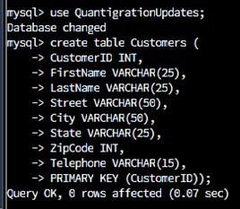

# Self-Assessment

Everyone will say that they accomplished a lot while they were attending college. They will say that "Hey, look at all the pretty code I created. Look at me." While this may fine for most students, not many can say that they did this to challenge themselves. To pick the degree in which they knew the least about beforehand to see what their limits are to learning. This was my degree path. I had never seen a single line of code before I started this degree and knew even less about how computers functioned. Before this degree, I only took jobs that required a lot of physical demand on the body. Not much in intelligence. This became boring and I decided to utilize my VA benefits to get a degree and to challenge myself along the way. Fast forward to present day and I finished this degree with a 3.9 GPA and completely baffled even myself. I knew beforehand that I had a strong pantient for picking up new skills, but this even amazed me with the success of this experiment.

Below are three "artifacts" that I created to showcase what I accomplished while I studied at Southern New Hampshire University. These three are in three separate categories: Software Design (Artifact 1), Data Structure (Artifact 2), and lastly Databases. In this last class, we were instructed to choose an artifact from one of our previous courses and modify it to showcase that we indeed did learn how to engineer software even at the drop of a hat. I decided to modify mine in such a way that will showcase my outside perspective rather than intelligence. To find flaws that I noticed about the scenario that we were working with and fix it for any future employers. I hope you enjoy.

<p align="center">
    <iframe width="560" height="315" src="https://youtu.be/siCQzUPWlwU" title="Code Review" frameborder="0" allow="accelerometer; autoplay; clipboard-write; encrypted-media; gyroscope; picture-in-picture" allowfullscreen></iframe>
  </p>

# Artifact 1

**BEFORE**
```js
/*
 * Copyright (c) 2015-2020, Texas Instruments Incorporated
 * All rights reserved.
 *
 * Redistribution and use in source and binary forms, with or without
 * modification, are permitted provided that the following conditions
 * are met:
 *
 * *  Redistributions of source code must retain the above copyright
 *    notice, this list of conditions and the following disclaimer.
 *
 * *  Redistributions in binary form must reproduce the above copyright
 *    notice, this list of conditions and the following disclaimer in the
 *    documentation and/or other materials provided with the distribution.
 *
 * *  Neither the name of Texas Instruments Incorporated nor the names of
 *    its contributors may be used to endorse or promote products derived
 *    from this software without specific prior written permission.
 *
 * THIS SOFTWARE IS PROVIDED BY THE COPYRIGHT HOLDERS AND CONTRIBUTORS "AS IS"
 * AND ANY EXPRESS OR IMPLIED WARRANTIES, INCLUDING, BUT NOT LIMITED TO,
 * THE IMPLIED WARRANTIES OF MERCHANTABILITY AND FITNESS FOR A PARTICULAR
 * PURPOSE ARE DISCLAIMED. IN NO EVENT SHALL THE COPYRIGHT OWNER OR
 * CONTRIBUTORS BE LIABLE FOR ANY DIRECT, INDIRECT, INCIDENTAL, SPECIAL,
 * EXEMPLARY, OR CONSEQUENTIAL DAMAGES (INCLUDING, BUT NOT LIMITED TO,
 * PROCUREMENT OF SUBSTITUTE GOODS OR SERVICES; LOSS OF USE, DATA, OR PROFITS;
 * OR BUSINESS INTERRUPTION) HOWEVER CAUSED AND ON ANY THEORY OF LIABILITY,
 * WHETHER IN CONTRACT, STRICT LIABILITY, OR TORT (INCLUDING NEGLIGENCE OR
 * OTHERWISE) ARISING IN ANY WAY OUT OF THE USE OF THIS SOFTWARE,
 * EVEN IF ADVISED OF THE POSSIBILITY OF SUCH DAMAGE.
 */

/*
 *  ======== gpiointerrupt.c ========
 */
#include <stdint.h>
#include <stddef.h>
#include <ti/drivers/Timer.h>

/* Driver Header files */
#include <ti/drivers/GPIO.h>
#include <ti/drivers/I2C.h>
#include <ti/drivers/UART.h>

/* Driver configuration */
#include "ti_drivers_config.h"

// Driver Handles - Global variables
Timer_Handle timer0;

#define DISPLAY(x) UART_write(uart, &output, x);
// UART Global Variables
char output[64];
int bytesToSend;
// Driver Handles - Global variables
UART_Handle uart;

// I2C Global Variables
int leftButton = 0;
int rightButton = 0;
static const struct {
 uint8_t address;
 uint8_t resultReg;
 char *id;
} sensors[3] = {
 { 0x48, 0x0000, "11X" },
 { 0x49, 0x0000, "116" },
 { 0x41, 0x0001, "006" }
};
uint8_t txBuffer[1];
uint8_t rxBuffer[2];
I2C_Transaction i2cTransaction;

// Driver Handles - Global variables
I2C_Handle i2c;

void gpioButtonFxn0(uint_least8_t index){
//    GPIO_toggle(CONFIG_GPIO_LED_0);
    leftButton = 1;
}

void gpioButtonFxn1(uint_least8_t index){
//    GPIO_toggle(CONFIG_GPIO_LED_0);
    rightButton = 1;
}

void initUART(void){
    UART_Params uartParams;
    // Init the driver
    UART_init();
    // Configure the driver
    UART_Params_init(&uartParams);
    uartParams.writeDataMode = UART_DATA_BINARY;
    uartParams.readDataMode = UART_DATA_BINARY;
    uartParams.readReturnMode = UART_RETURN_FULL;
    uartParams.baudRate = 115200;
    // Open the driver
    uart = UART_open(CONFIG_UART_0, &uartParams);
    if (uart == NULL) {
        /* UART_open() failed */
        while (1);
    }
}

// Make sure you call initUART() before calling this function.
void initI2C(void){
    int8_t i, found;
    I2C_Params i2cParams;
    DISPLAY(snprintf(output, 64, "Initializing I2C Driver - "))
    // Init the driver
    I2C_init();
    // Configure the driver
    I2C_Params_init(&i2cParams);
    i2cParams.bitRate = I2C_400kHz;

    // Open the driver
    i2c = I2C_open(CONFIG_I2C_0, &i2cParams);
    if (i2c == NULL){
        DISPLAY(snprintf(output, 64, "Failed\n\r"))
         while (1);
    }

    DISPLAY(snprintf(output, 32, "Passed\n\r"))

     // Boards were shipped with different sensors.
     // Welcome to the world of embedded systems.
     // Try to determine which sensor we have.
     // Scan through the possible sensor addresses

     /* Common I2C transaction setup */
     i2cTransaction.writeBuf = txBuffer;
     i2cTransaction.writeCount = 1;
     i2cTransaction.readBuf = rxBuffer;
     i2cTransaction.readCount = 0;
     found = false;
     for (i=0; i<3; ++i){
         i2cTransaction.slaveAddress = sensors[i].address;
         txBuffer[0] = sensors[i].resultReg;
         DISPLAY(snprintf(output, 64, "Is this %s? ", sensors[i].id))
         if (I2C_transfer(i2c, &i2cTransaction)){
             DISPLAY(snprintf(output, 64, "Found\n\r"))
             found = true;
             break;
         }
         DISPLAY(snprintf(output, 64, "No\n\r"))
     }
     if(found){
         DISPLAY(snprintf(output, 64, "Detected TMP%s I2C address:%x\n\r", sensors[i].id, i2cTransaction.slaveAddress))
     }
     else{
         DISPLAY(snprintf(output, 64, "Temperature sensor was not found\n\r"))
     }
}

int16_t readTemp(void){
    int j;
    int16_t temperature = 0;
    i2cTransaction.readCount = 2;
    if (I2C_transfer(i2c, &i2cTransaction)){
/*
 * Extract degrees C from the received data;
 * see TMP sensor datasheet
 */
        temperature = (rxBuffer[0] << 8) | (rxBuffer[1]);
        temperature *= 0.0078125;
 /*
 * If the MSB is set '1', then we have a 2's complement
 * negative value which needs to be sign extended
 */
        if (rxBuffer[0] & 0x80){
            temperature |= 0xF000;
        }
    }
    else{
        DISPLAY(snprintf(output, 64, "Error reading temperature sensor (%d)\n\r",i2cTransaction.status))
        DISPLAY(snprintf(output, 64, "Please power cycle your board by unplugging USB and plugging back in.\n\r"))
 }
 return temperature;
}

volatile unsigned char TimerFlag = 0;
void timerCallback(Timer_Handle myHandle, int_fast16_t status){
//    GPIO_toggle(CONFIG_GPIO_LED_0); //red button
    TimerFlag = 1;
}

void initTimer(void){
    Timer_Params params;
    Timer_init();
    Timer_Params_init(&params);
    params.period = 100000;
    params.periodUnits = Timer_PERIOD_US;
    params.timerMode = Timer_CONTINUOUS_CALLBACK;
    params.timerCallback = timerCallback;
    timer0 = Timer_open(CONFIG_TIMER_0, &params);
    if (timer0 == NULL) {
     /* Failed to initialized timer */
        while (1) {}
    }
    if (Timer_start(timer0) == Timer_STATUS_ERROR) {
     /* Failed to start timer */
        while (1) {}
    }
}

/*
 *  ======== mainThread ========
 */
void *mainThread(void *arg0){

    /* Call driver init functions */
    GPIO_init();

    /* Configure the LED and button pins */
    GPIO_setConfig(CONFIG_GPIO_LED_0, GPIO_CFG_OUT_STD | GPIO_CFG_OUT_LOW);
    GPIO_setConfig(CONFIG_GPIO_BUTTON_0, GPIO_CFG_IN_PU | GPIO_CFG_IN_INT_FALLING);
    GPIO_setConfig(CONFIG_GPIO_BUTTON_1, GPIO_CFG_IN_PU | GPIO_CFG_IN_INT_FALLING);

    /* Install Button callback */
    GPIO_setCallback(CONFIG_GPIO_BUTTON_0, gpioButtonFxn0);
    GPIO_setCallback(CONFIG_GPIO_BUTTON_1, gpioButtonFxn1);

    /* Enable interrupts */
    GPIO_enableInt(CONFIG_GPIO_BUTTON_0);
    GPIO_enableInt(CONFIG_GPIO_BUTTON_1);

    //button press into a counter

    initUART();
    initI2C();
    initTimer();

    int temperature = readTemp();
    int setpoint = readTemp();
    int heat = 0;
    int seconds = 0;

    while(1){

        // Use the right button to increase the set temp
        if (rightButton == 1){
            setpoint ++;
            rightButton = 0;
        }

        // Use the left button to decrease the set temp
        if (leftButton == 1){
            setpoint --;
            leftButton = 0;
        }

        // If the temperature is less than the temperature set, enter this loop
        if (temperature < setpoint){

            // If you can add 5 degrees to the temp, and it exceed the set temp, turn the furnace off
            // This is to ensure the furnace isn't constantly turning on and off. Instead, it utilizes
            // all the heat it already generated to coast to the set temp.
            if ((temperature + 5) > setpoint) {
                GPIO_write(CONFIG_GPIO_LED_0, CONFIG_GPIO_LED_OFF);
                heat = 0;
            }

            // Else, keep the furnace generating heat
            // This is also needed because it will take some time for the furnace to come up to the needed
            // heating level before it will start to produce heat to increase the temp of the house.
            else {
                GPIO_write(CONFIG_GPIO_LED_0, CONFIG_GPIO_LED_ON);
                heat = 1;
            }
           
        // Else, turn the furnace off
        }else {
            GPIO_write(CONFIG_GPIO_LED_0, CONFIG_GPIO_LED_OFF);
            heat = 0;
        }
        DISPLAY( snprintf(output, 64, "<%02d,%02d,%d,%04d>\n\r", temperature, setpoint, heat, seconds))
        while(!TimerFlag){}
        TimerFlag = 0;
        ++seconds;
    }
    return (NULL);
}

```

This artifact was created earlier this year. This project was intended to teach us embedded programming utilizing a Texas Instruments board to make a working thermostat.

I selected this item, because of all the projects that I created, this one was one of the most challenging for me. It is one thing to make a program do something you want, but for me, it was even more challenging to work with preset configurations and working with timers. In the end, I worked it out, and managed to make a working thermostat. I improved this project by looking into HOW the thermostat was going to operate in a “real world” scenario and saw an opportunity to increase the efficiency of the furnace it would be operating. The objective was to delay the heating code to activate when the if else loop would trigger the event. If I did this, it would be longer in between the furnace activating and deactivating, alleviating some of the strain turning on and off this piece of equipment. This in turn would mean fewer times the furnace would need repairs in its lifetime.

After I made this small change, I met the objective for the enhancement that I had planned. Any more changes to this code, in relation to efficacy, would require more knowledge of furnaces. This would entail average time to come up to output heat, how long it would take to dissipate the heat, and any other concerns that could be raised over the functionality of the pieces of equipment used.

All in all, I was reminded of the coding standard “keep it simple stupid” while making this enhancement and while making this project in general. I didn’t need anything too fancy to get the job done. All I needed was to keep things simple, so no misunderstandings happened between the program and myself. Other than trying to keep things simple, there were no challenges faced.

**AFTER**
```js
/*
 * Copyright (c) 2015-2020, Texas Instruments Incorporated
 * All rights reserved.
 *
 * Redistribution and use in source and binary forms, with or without
 * modification, are permitted provided that the following conditions
 * are met:
 *
 * *  Redistributions of source code must retain the above copyright
 *    notice, this list of conditions and the following disclaimer.
 *
 * *  Redistributions in binary form must reproduce the above copyright
 *    notice, this list of conditions and the following disclaimer in the
 *    documentation and/or other materials provided with the distribution.
 *
 * *  Neither the name of Texas Instruments Incorporated nor the names of
 *    its contributors may be used to endorse or promote products derived
 *    from this software without specific prior written permission.
 *
 * THIS SOFTWARE IS PROVIDED BY THE COPYRIGHT HOLDERS AND CONTRIBUTORS "AS IS"
 * AND ANY EXPRESS OR IMPLIED WARRANTIES, INCLUDING, BUT NOT LIMITED TO,
 * THE IMPLIED WARRANTIES OF MERCHANTABILITY AND FITNESS FOR A PARTICULAR
 * PURPOSE ARE DISCLAIMED. IN NO EVENT SHALL THE COPYRIGHT OWNER OR
 * CONTRIBUTORS BE LIABLE FOR ANY DIRECT, INDIRECT, INCIDENTAL, SPECIAL,
 * EXEMPLARY, OR CONSEQUENTIAL DAMAGES (INCLUDING, BUT NOT LIMITED TO,
 * PROCUREMENT OF SUBSTITUTE GOODS OR SERVICES; LOSS OF USE, DATA, OR PROFITS;
 * OR BUSINESS INTERRUPTION) HOWEVER CAUSED AND ON ANY THEORY OF LIABILITY,
 * WHETHER IN CONTRACT, STRICT LIABILITY, OR TORT (INCLUDING NEGLIGENCE OR
 * OTHERWISE) ARISING IN ANY WAY OUT OF THE USE OF THIS SOFTWARE,
 * EVEN IF ADVISED OF THE POSSIBILITY OF SUCH DAMAGE.
 */

/*
 *  ======== gpiointerrupt.c ========
 */
#include <stdint.h>
#include <stddef.h>
#include <ti/drivers/Timer.h>

/* Driver Header files */
#include <ti/drivers/GPIO.h>
#include <ti/drivers/I2C.h>
#include <ti/drivers/UART.h>

/* Driver configuration */
#include "ti_drivers_config.h"

// Driver Handles - Global variables
Timer_Handle timer0;

#define DISPLAY(x) UART_write(uart, &output, x);
// UART Global Variables
char output[64];
int bytesToSend;
// Driver Handles - Global variables
UART_Handle uart;

// I2C Global Variables
int leftButton = 0;
int rightButton = 0;
static const struct {
 uint8_t address;
 uint8_t resultReg;
 char *id;
} sensors[3] = {
 { 0x48, 0x0000, "11X" },
 { 0x49, 0x0000, "116" },
 { 0x41, 0x0001, "006" }
};
uint8_t txBuffer[1];
uint8_t rxBuffer[2];
I2C_Transaction i2cTransaction;

// Driver Handles - Global variables
I2C_Handle i2c;

void gpioButtonFxn0(uint_least8_t index){
//    GPIO_toggle(CONFIG_GPIO_LED_0);
    leftButton = 1;
}

void gpioButtonFxn1(uint_least8_t index){
//    GPIO_toggle(CONFIG_GPIO_LED_0);
    rightButton = 1;
}

void initUART(void){
    UART_Params uartParams;
    // Init the driver
    UART_init();
    // Configure the driver
    UART_Params_init(&uartParams);
    uartParams.writeDataMode = UART_DATA_BINARY;
    uartParams.readDataMode = UART_DATA_BINARY;
    uartParams.readReturnMode = UART_RETURN_FULL;
    uartParams.baudRate = 115200;
    // Open the driver
    uart = UART_open(CONFIG_UART_0, &uartParams);
    if (uart == NULL) {
        /* UART_open() failed */
        while (1);
    }
}

// Make sure you call initUART() before calling this function.
void initI2C(void){
    int8_t i, found;
    I2C_Params i2cParams;
    DISPLAY(snprintf(output, 64, "Initializing I2C Driver - "))
    // Init the driver
    I2C_init();
    // Configure the driver
    I2C_Params_init(&i2cParams);
    i2cParams.bitRate = I2C_400kHz;

    // Open the driver
    i2c = I2C_open(CONFIG_I2C_0, &i2cParams);
    if (i2c == NULL){
        DISPLAY(snprintf(output, 64, "Failed\n\r"))
         while (1);
    }

    DISPLAY(snprintf(output, 32, "Passed\n\r"))

     // Boards were shipped with different sensors.
     // Welcome to the world of embedded systems.
     // Try to determine which sensor we have.
     // Scan through the possible sensor addresses

     /* Common I2C transaction setup */
     i2cTransaction.writeBuf = txBuffer;
     i2cTransaction.writeCount = 1;
     i2cTransaction.readBuf = rxBuffer;
     i2cTransaction.readCount = 0;
     found = false;
     for (i=0; i<3; ++i){
         i2cTransaction.slaveAddress = sensors[i].address;
         txBuffer[0] = sensors[i].resultReg;
         DISPLAY(snprintf(output, 64, "Is this %s? ", sensors[i].id))
         if (I2C_transfer(i2c, &i2cTransaction)){
             DISPLAY(snprintf(output, 64, "Found\n\r"))
             found = true;
             break;
         }
         DISPLAY(snprintf(output, 64, "No\n\r"))
     }
     if(found){
         DISPLAY(snprintf(output, 64, "Detected TMP%s I2C address:%x\n\r", sensors[i].id, i2cTransaction.slaveAddress))
     }
     else{
         DISPLAY(snprintf(output, 64, "Temperature sensor was not found\n\r"))
     }
}

int16_t readTemp(void){
    int j;
    int16_t temperature = 0;
    i2cTransaction.readCount = 2;
    if (I2C_transfer(i2c, &i2cTransaction)){
/*
 * Extract degrees C from the received data;
 * see TMP sensor datasheet
 */
        temperature = (rxBuffer[0] << 8) | (rxBuffer[1]);
        temperature *= 0.0078125;
 /*
 * If the MSB is set '1', then we have a 2's complement
 * negative value which needs to be sign extended
 */
        if (rxBuffer[0] & 0x80){
            temperature |= 0xF000;
        }
    }
    else{
        DISPLAY(snprintf(output, 64, "Error reading temperature sensor (%d)\n\r",i2cTransaction.status))
        DISPLAY(snprintf(output, 64, "Please power cycle your board by unplugging USB and plugging back in.\n\r"))
 }
 return temperature;
}

volatile unsigned char TimerFlag = 0;
void timerCallback(Timer_Handle myHandle, int_fast16_t status){
//    GPIO_toggle(CONFIG_GPIO_LED_0); //red button
    TimerFlag = 1;
}

void initTimer(void){
    Timer_Params params;
    Timer_init();
    Timer_Params_init(&params);
    params.period = 100000;
    params.periodUnits = Timer_PERIOD_US;
    params.timerMode = Timer_CONTINUOUS_CALLBACK;
    params.timerCallback = timerCallback;
    timer0 = Timer_open(CONFIG_TIMER_0, &params);
    if (timer0 == NULL) {
     /* Failed to initialized timer */
        while (1) {}
    }
    if (Timer_start(timer0) == Timer_STATUS_ERROR) {
     /* Failed to start timer */
        while (1) {}
    }
}

/*
 *  ======== mainThread ========
 */
void *mainThread(void *arg0){

    /* Call driver init functions */
    GPIO_init();

    /* Configure the LED and button pins */
    GPIO_setConfig(CONFIG_GPIO_LED_0, GPIO_CFG_OUT_STD | GPIO_CFG_OUT_LOW);
    GPIO_setConfig(CONFIG_GPIO_BUTTON_0, GPIO_CFG_IN_PU | GPIO_CFG_IN_INT_FALLING);
    GPIO_setConfig(CONFIG_GPIO_BUTTON_1, GPIO_CFG_IN_PU | GPIO_CFG_IN_INT_FALLING);

    /* Install Button callback */
    GPIO_setCallback(CONFIG_GPIO_BUTTON_0, gpioButtonFxn0);
    GPIO_setCallback(CONFIG_GPIO_BUTTON_1, gpioButtonFxn1);

    /* Enable interrupts */
    GPIO_enableInt(CONFIG_GPIO_BUTTON_0);
    GPIO_enableInt(CONFIG_GPIO_BUTTON_1);

    //button press into a counter

    initUART();
    initI2C();
    initTimer();

    int temperature = readTemp();
    int setpoint = readTemp();
    int heat = 0;
    int seconds = 0;

    while(1){

        // Use the right button to increase the set temp
        if (rightButton == 1){
            setpoint ++;
            rightButton = 0;
        }

        // Use the left button to decrease the set temp
        if (leftButton == 1){
            setpoint --;
            leftButton = 0;
        }

        // If the temperature is less than the temperature set, enter this loop
        if (temperature < setpoint){

            // If you can add 5 degrees to the temp, and it exceed the set temp, turn the furnace off
            // This is to ensure the furnace isn't constantly turning on and off. Instead, it utilizes
            // all the heat it already generated to coast to the set temp.
            if ((temperature + 5) > setpoint) {
                GPIO_write(CONFIG_GPIO_LED_0, CONFIG_GPIO_LED_OFF);
                heat = 0;
            }

            // Else, keep the furnace generating heat
            // This is also needed because it will take some time for the furnace to come up to the needed
            // heating level before it will start to produce heat to increase the temp of the house.
            else {
                GPIO_write(CONFIG_GPIO_LED_0, CONFIG_GPIO_LED_ON);
                heat = 1;
            }
           
        // Else, turn the furnace off
        }else {
            GPIO_write(CONFIG_GPIO_LED_0, CONFIG_GPIO_LED_OFF);
            heat = 0;
        }
        DISPLAY( snprintf(output, 64, "<%02d,%02d,%d,%04d>\n\r", temperature, setpoint, heat, seconds))
        while(!TimerFlag){}
        TimerFlag = 0;
        ++seconds;
    }
    return (NULL);
}

```

# Artifact 2

**BEFORE**
```js
{
 "cells": [
  {
   "cell_type": "code",
   "execution_count": 43,
   "metadata": {
    "scrolled": true
   },
   "outputs": [
    {
     "data": {
      "text/html": [
       "<div>\n",
       "  <iframe src=\"/app/endpoints/e833245290c34c5b842eb3060630cb76/\" width=800 height=600 frameborder=\"0\"></iframe>\n",
       "  <hr/><a href=\"/app/endpoints/e833245290c34c5b842eb3060630cb76/\" target=\"_new\">Open in new window</a> for /app/endpoints/e833245290c34c5b842eb3060630cb76/\n",
       "</div>"
      ],
      "text/plain": [
       "<jupyter_plotly_dash.dash_wrapper.JupyterDash at 0x7f558809fb70>"
      ]
     },
     "execution_count": 43,
     "metadata": {},
     "output_type": "execute_result"
    }
   ],
   "source": [
    "from jupyter_plotly_dash import JupyterDash\n",
    "\n",
    "import dash\n",
    "import dash_leaflet as dl\n",
    "import dash_core_components as dcc\n",
    "import dash_html_components as html\n",
    "import plotly.express as px\n",
    "import dash_table as dt\n",
    "from dash.dependencies import Input, Output, State\n",
    "\n",
    "import os\n",
    "import urllib.parse\n",
    "import numpy as np\n",
    "import pandas as pd\n",
    "from pymongo import MongoClient\n",
    "from bson.json_util import dumps\n",
    "import matplotlib.pyplot as plt\n",
    "import base64\n",
    "\n",
    "#### FIX ME #####\n",
    "# change animal_shelter and AnimalShelter to match your CRUD Python module file name and class name\n",
    "from animal_shelter import AnimalShelter\n",
    "\n",
    "\n",
    "\n",
    "\n",
    "app = JupyterDash('SimpleExample')\n",
    "###########################\n",
    "# Data Manipulation / Model\n",
    "###########################\n",
    "# FIX ME change for your username and password and CRUD Python module name\n",
    "#FIX ME Add in Grazioso Salvare’s logo\n",
    "image_filename = 'Grazioso Salvare Logo.png' # replace with your own image\n",
    "\n",
    "encoded_image = base64.b64encode(open(image_filename, 'rb').read())\n",
    "\n",
    "username = \"aacuser\"\n",
    "password = \"123\"\n",
    "shelter = AnimalShelter(username, password)\n",
    "\n",
    "\n",
    "# class read method must support return of cursor object \n",
    "df = pd.DataFrame.from_records(shelter.read_all({}))\n",
    "\n",
    "\n",
    "\n",
    "#########################\n",
    "# Dashboard Layout / View\n",
    "#########################\n",
    "\n",
    "\n",
    "#FIX ME Place the HTML image tag in the line below into the app.layout code according to your design\n",
    "#FIX ME Also remember to include a unique identifier such as your name or date\n",
    "\n",
    "\n",
    "app.layout = html.Div([\n",
    "    html.Div(id='hidden-div', style={'display':'none'}),\n",
    "    html.Center(html.B(html.H1('Els, Nicholas Dashboard'))),\n",
    "    html.Center(html.Img(src='data:image/png;base64,{}'.format(encoded_image.decode()))),\n",
    "    html.Hr(),\n",
    "    html.Div(dcc.RadioItems(options =[{'label': 'Reset', 'value': 'Reset'},\n",
    "                          {'label': 'Disaster Rescue', 'value': 'Disaster'},\n",
    "                         {'label': 'Mountain Rescue', 'value': 'Mountain'},\n",
    "                          {'label': 'Water Rescue', 'value': 'Water'},\n",
                              {'label': 'Emotional Support', 'value': 'Emotional'}], value = 'Reset',\n",
    "                   labelStyle={'display': 'inline-block'}, id='radio')\n",
    "    ),\n",
    "    html.Hr(),\n",
    "    \n",
    "    dt.DataTable(\n",
    "        id='datatable-id',\n",
    "        columns=[\n",
    "            {\"name\": i, \"id\": i, \"deletable\": False, \"selectable\": True} for i in df.columns\n",
    "        ],\n",
    "        data=df.to_dict('records'),\n",
    "        editable=False,\n",
    "        filter_action=\"native\",\n",
    "        sort_action=\"native\",\n",
    "        sort_mode=\"multi\",\n",
    "        column_selectable=False,\n",
    "        row_selectable=\"single\",\n",
    "        row_deletable=False,\n",
    "        selected_columns=[],\n",
    "        selected_rows=[0],\n",
    "        page_action=\"native\",\n",
    "        page_current= 0,\n",
    "        page_size= 10,\n",
    "#FIXME: Set up the features for your interactive data table to make it user-friendly for your client\n",
    "#If you completed the Module Six Assignment, you can copy in the code you created here \n",
    "        \n",
    "    ),\n",
    "    html.Br(),\n",
    "    html.Hr(),\n",
    "#This sets up the dashboard so that your chart and your geolocation chart are side-by-side\n",
    "    html.Div(className='row',\n",
    "         style={'display' : 'flex'},\n",
    "             children=[\n",
    "        html.Div(\n",
    "            id='graph-id',\n",
    "            className='col s12 m6',\n",
    "            \n",
    "            ),\n",
    "        html.Div(\n",
    "            id='map-id',\n",
    "            className='col s12 m6',\n",
    "            )\n",
    "        ])\n",
    "])\n",
    "\n",
    "#############################################\n",
    "# Interaction Between Components / Controller\n",
    "#############################################\n",
    "@app.callback(\n",
    "    Output('datatable-id', 'style_data_conditional'),\n",
    "    [Input('datatable-id', 'selected_columns')]\n",
    ")\n",
    "def update_styles(selected_columns):\n",
    "    return [{\n",
    "        'if': { 'column_id': i },\n",
    "        'background_color': '#D2F3FF'\n",
    "    } for i in selected_columns]\n",
    "\n",
    "\n",
    "    \n",
    "@app.callback([Output('datatable-id','data'),\n",
    "              Output('datatable-id', 'columns')],\n",
    "    [Input('radio', 'value')])\n",
    "def update_dashboard(filter_type):\n",
    "### FIX ME Add code to filter interactive data table with MongoDB queries\n",
    "    if filter_type == 'Reset':\n",
    "        df = pd.DataFrame.from_records(shelter.read_all({'animal_type': 'Dog'}))\n",
    "    elif filter_type == 'Disaster':\n",
    "        df = pd.DataFrame.from_records(shelter.read_all({\n",
    "            \"animal_type\":\"Dog\",\"breed\":{\"$in\":\n",
    "            [\"Doberman Pinscher\",\"German Shepherd\",\"Golden Retriever\",\"Bloodhound\",\"Rottweiler\"]},\n",
    "            \"sex_upon_outcome\":\"Intact Male\",\"age_upon_outcome_in_weeks\":{\"$gte\":20},\n",
    "            \"age_upon_outcome_in_weeks\":{\"$lte\":300}}))\n",
    "    elif filter_type == 'Mountain':\n",
    "        df = pd.DataFrame.from_records(shelter.read_all({\n",
    "            \"animal_type\":\"Dog\",\"breed\":{\"$in\":\n",
    "            [\"German Shepherd\",\"Malamute\",\"Old English Sheepdog\",\"Siberian Husky\",\"Rottweiler\"]},\n",
    "            \"sex_upon_outcome\":\"Intact Male\",\"age_upon_outcome_in_weeks\":{\"$gte\":26},\n",
    "            \"age_upon_outcome_in_weeks\":{\"$lte\":156}}))\n",
    "    elif filter_type == 'Water':\n",
    "        df = pd.DataFrame.from_records(shelter.read_all({\n",
    "            \"animal_type\":\"Dog\",\"breed\":{\"$in\":\n",
    "                            [\"Labrador Retriever Mix\",\"Chesapeake Bay Retriever\",\"Newfoundland\"]},\n",
    "            \"sex_upon_outcome\":\"Intact Female\",\"age_upon_outcome_in_weeks\":{\"$gte\":26},\"age_upon_outcome_in_weeks\":\n",
    "            {\"$lte\":156}}))\n",
          elif filter_type == 'Water':\n",
    "        df = pd.DataFrame.from_records(shelter.read_all({\n",
    "            \"animal_type\":\"Dog\",\"breed\":{\"$in\":\n",
    "                            [\"Labrador Retriever Mix\",\"Chesapeake Bay Retriever\",\"Newfoundland\"]},\n",
    "            \"sex_upon_outcome\":\"Intact Female\",\"age_upon_outcome_in_weeks\":{\"$gte\":26},\"age_upon_outcome_in_weeks\":\n",
    "            {\"$lte\":156}}))\n",
          elif filter_type == 'Emotional':\n",
          "        df = pd.DataFrame.from_records(shelter.read_all({\n",
          "            \"animal_type\":\"Cat\",\n",
          "            \"sex_upon_outcome\":\"Spayed Female\",\n",
          "             \"sex_upon_outcome\":\"Nuetered Male\",\n",
    "  \n",
    "    columns=[{\"name\": i, \"id\": i, \"deletable\": False, \"selectable\": True} for i in df.columns]\n",
    "    data=df.to_dict('records')\n",
    "        \n",
    "        \n",
    "    return (data,columns)\n",
    "\n",
    "\n",
    "@app.callback(\n",
    "    Output('graph-id', \"children\"),\n",
    "    [Input('datatable-id', \"derived_viewport_data\")])\n",
    "\n",
    "def update_graphs(viewData):\n",
    "    ###FIX ME ####\n",
    "    # add code for chart of your choice (e.g. pie chart) #\n",
    "    dff = pd.DataFrame.from_dict(viewData)\n",
    "    return [\n",
    "        dcc.Graph(            \n",
    "            figure = px.pie(dff, names='breed')\n",
    "        )    \n",
    "    ]\n",
    "\n",
    "@app.callback(\n",
    "    Output('map-id', \"children\"),\n",
    "    [Input('datatable-id', \"derived_viewport_data\")])\n",
    "def update_map(viewData):\n",
    "#FIXME: Add in the code for your geolocation chart\n",
    "#If you completed the Module Six Assignment, you can copy in the code you created here.\n",
    "    dff = pd.DataFrame.from_dict(viewData)\n",
    "    # Austin TX is at [30.75,-97.48]\n",
    "    return [\n",
    "        dl.Map(style={'width': '1000px', 'height': '500px'}, center=[30.75,-97.48], zoom=10, children=[\n",
    "            dl.TileLayer(id=\"base-layer-id\"),\n",
    "            # Marker with tool tip and popup\n",
    "            dl.Marker(position=[30.75,-97.48], children=[\n",
    "                dl.Tooltip(dff.iloc[0,4]),\n",
    "                dl.Popup([\n",
    "                    html.H1(\"Animal Name\"),\n",
    "                    html.P(dff.iloc[1,9])\n",
    "            ])\n",
    "            ])\n",
    "        ])\n",
    "    ]\n",
    "\n",
    "\n",
    "app"
   ]
  },
  {
   "cell_type": "code",
   "execution_count": null,
   "metadata": {},
   "outputs": [],
   "source": []
  }
 ],
 "metadata": {
  "kernelspec": {
   "display_name": "Python 3",
   "language": "python",
   "name": "python3"
  },
  "language_info": {
   "codemirror_mode": {
    "name": "ipython",
    "version": 3
   },
   "file_extension": ".py",
   "mimetype": "text/x-python",
   "name": "python",
   "nbconvert_exporter": "python",
   "pygments_lexer": "ipython3",
   "version": "3.6.9"
  }
 },
 "nbformat": 4,
 "nbformat_minor": 2
}

```

This artifact was created earlier this year. This project was intended to teach us NoSQL queries and to export them to an HTML interface that the user could use.

I selected this item, because of all the projects that I created, this one was the most fun for me. It let me put all my programing skills that I learned since my arrival at Southern New Hampshire University to use. It also allowed me to combine a few of my classes to show me that I could make real world changes. The objective that I wanted to make in this project was to add more functionality to the queries. To build on the structure that I had already made. This would allow the user more freedom to do searches. The enhancement that I decided was to introduce emotional support cats. Since the early 2000’s, we have seen a decline in the number of visitors to national parks and other such activities. This leads to more people being in less physically active activities.

After I made this small change, I met the objective for the enhancement that I had planned. Any more changes to this code, in relation to breed and age, would require more knowledge of what people are looking for. This would entail leaning the temperament of all the breeds, climate of the client, and what the client would need them to do outside of their supporting roles.

All in all, I was reminded of the coding standard “keep it simple stupid” while making this enhancement and while making this project in general. I didn’t need anything too fancy to get the job done. All I needed was to keep things simple, so no misunderstandings happened between the program and myself. Other than trying to keep things simple, there were no challenges faced.

**AFTER**
```js
{
 "cells": [
  {
   "cell_type": "code",
   "execution_count": 43,
   "metadata": {
    "scrolled": true
   },
   "outputs": [
    {
     "data": {
      "text/html": [
       "<div>\n",
       "  <iframe src=\"/app/endpoints/e833245290c34c5b842eb3060630cb76/\" width=800 height=600 frameborder=\"0\"></iframe>\n",
       "  <hr/><a href=\"/app/endpoints/e833245290c34c5b842eb3060630cb76/\" target=\"_new\">Open in new window</a> for /app/endpoints/e833245290c34c5b842eb3060630cb76/\n",
       "</div>"
      ],
      "text/plain": [
       "<jupyter_plotly_dash.dash_wrapper.JupyterDash at 0x7f558809fb70>"
      ]
     },
     "execution_count": 43,
     "metadata": {},
     "output_type": "execute_result"
    }
   ],
   "source": [
    "from jupyter_plotly_dash import JupyterDash\n",
    "\n",
    "import dash\n",
    "import dash_leaflet as dl\n",
    "import dash_core_components as dcc\n",
    "import dash_html_components as html\n",
    "import plotly.express as px\n",
    "import dash_table as dt\n",
    "from dash.dependencies import Input, Output, State\n",
    "\n",
    "import os\n",
    "import urllib.parse\n",
    "import numpy as np\n",
    "import pandas as pd\n",
    "from pymongo import MongoClient\n",
    "from bson.json_util import dumps\n",
    "import matplotlib.pyplot as plt\n",
    "import base64\n",
    "\n",
    "#### FIX ME #####\n",
    "# change animal_shelter and AnimalShelter to match your CRUD Python module file name and class name\n",
    "from animal_shelter import AnimalShelter\n",
    "\n",
    "\n",
    "\n",
    "\n",
    "app = JupyterDash('SimpleExample')\n",
    "###########################\n",
    "# Data Manipulation / Model\n",
    "###########################\n",
    "# FIX ME change for your username and password and CRUD Python module name\n",
    "#FIX ME Add in Grazioso Salvare’s logo\n",
    "image_filename = 'Grazioso Salvare Logo.png' # replace with your own image\n",
    "\n",
    "encoded_image = base64.b64encode(open(image_filename, 'rb').read())\n",
    "\n",
    "username = \"aacuser\"\n",
    "password = \"123\"\n",
    "shelter = AnimalShelter(username, password)\n",
    "\n",
    "\n",
    "# class read method must support return of cursor object \n",
    "df = pd.DataFrame.from_records(shelter.read_all({}))\n",
    "\n",
    "\n",
    "\n",
    "#########################\n",
    "# Dashboard Layout / View\n",
    "#########################\n",
    "\n",
    "\n",
    "#FIX ME Place the HTML image tag in the line below into the app.layout code according to your design\n",
    "#FIX ME Also remember to include a unique identifier such as your name or date\n",
    "\n",
    "\n",
    "app.layout = html.Div([\n",
    "    html.Div(id='hidden-div', style={'display':'none'}),\n",
    "    html.Center(html.B(html.H1('Els, Nicholas Dashboard'))),\n",
    "    html.Center(html.Img(src='data:image/png;base64,{}'.format(encoded_image.decode()))),\n",
    "    html.Hr(),\n",
    "    html.Div(dcc.RadioItems(options =[{'label': 'Reset', 'value': 'Reset'},\n",
    "                          {'label': 'Disaster Rescue', 'value': 'Disaster'},\n",
    "                         {'label': 'Mountain Rescue', 'value': 'Mountain'},\n",
    "                          {'label': 'Water Rescue', 'value': 'Water'},\n",
                              {'label': 'Emotional Support', 'value': 'Emotional'}], value = 'Reset',\n",
    "                   labelStyle={'display': 'inline-block'}, id='radio')\n",
    "    ),\n",
    "    html.Hr(),\n",
    "    \n",
    "    dt.DataTable(\n",
    "        id='datatable-id',\n",
    "        columns=[\n",
    "            {\"name\": i, \"id\": i, \"deletable\": False, \"selectable\": True} for i in df.columns\n",
    "        ],\n",
    "        data=df.to_dict('records'),\n",
    "        editable=False,\n",
    "        filter_action=\"native\",\n",
    "        sort_action=\"native\",\n",
    "        sort_mode=\"multi\",\n",
    "        column_selectable=False,\n",
    "        row_selectable=\"single\",\n",
    "        row_deletable=False,\n",
    "        selected_columns=[],\n",
    "        selected_rows=[0],\n",
    "        page_action=\"native\",\n",
    "        page_current= 0,\n",
    "        page_size= 10,\n",
    "#FIXME: Set up the features for your interactive data table to make it user-friendly for your client\n",
    "#If you completed the Module Six Assignment, you can copy in the code you created here \n",
    "        \n",
    "    ),\n",
    "    html.Br(),\n",
    "    html.Hr(),\n",
    "#This sets up the dashboard so that your chart and your geolocation chart are side-by-side\n",
    "    html.Div(className='row',\n",
    "         style={'display' : 'flex'},\n",
    "             children=[\n",
    "        html.Div(\n",
    "            id='graph-id',\n",
    "            className='col s12 m6',\n",
    "            \n",
    "            ),\n",
    "        html.Div(\n",
    "            id='map-id',\n",
    "            className='col s12 m6',\n",
    "            )\n",
    "        ])\n",
    "])\n",
    "\n",
    "#############################################\n",
    "# Interaction Between Components / Controller\n",
    "#############################################\n",
    "@app.callback(\n",
    "    Output('datatable-id', 'style_data_conditional'),\n",
    "    [Input('datatable-id', 'selected_columns')]\n",
    ")\n",
    "def update_styles(selected_columns):\n",
    "    return [{\n",
    "        'if': { 'column_id': i },\n",
    "        'background_color': '#D2F3FF'\n",
    "    } for i in selected_columns]\n",
    "\n",
    "\n",
    "    \n",
    "@app.callback([Output('datatable-id','data'),\n",
    "              Output('datatable-id', 'columns')],\n",
    "    [Input('radio', 'value')])\n",
    "def update_dashboard(filter_type):\n",
    "### FIX ME Add code to filter interactive data table with MongoDB queries\n",
    "    if filter_type == 'Reset':\n",
    "        df = pd.DataFrame.from_records(shelter.read_all({'animal_type': 'Dog'}))\n",
    "    elif filter_type == 'Disaster':\n",
    "        df = pd.DataFrame.from_records(shelter.read_all({\n",
    "            \"animal_type\":\"Dog\",\"breed\":{\"$in\":\n",
    "            [\"Doberman Pinscher\",\"German Shepherd\",\"Golden Retriever\",\"Bloodhound\",\"Rottweiler\"]},\n",
    "            \"sex_upon_outcome\":\"Intact Male\",\"age_upon_outcome_in_weeks\":{\"$gte\":20},\n",
    "            \"age_upon_outcome_in_weeks\":{\"$lte\":300}}))\n",
    "    elif filter_type == 'Mountain':\n",
    "        df = pd.DataFrame.from_records(shelter.read_all({\n",
    "            \"animal_type\":\"Dog\",\"breed\":{\"$in\":\n",
    "            [\"German Shepherd\",\"Malamute\",\"Old English Sheepdog\",\"Siberian Husky\",\"Rottweiler\"]},\n",
    "            \"sex_upon_outcome\":\"Intact Male\",\"age_upon_outcome_in_weeks\":{\"$gte\":26},\n",
    "            \"age_upon_outcome_in_weeks\":{\"$lte\":156}}))\n",
    "    elif filter_type == 'Water':\n",
    "        df = pd.DataFrame.from_records(shelter.read_all({\n",
    "            \"animal_type\":\"Dog\",\"breed\":{\"$in\":\n",
    "                            [\"Labrador Retriever Mix\",\"Chesapeake Bay Retriever\",\"Newfoundland\"]},\n",
    "            \"sex_upon_outcome\":\"Intact Female\",\"age_upon_outcome_in_weeks\":{\"$gte\":26},\"age_upon_outcome_in_weeks\":\n",
    "            {\"$lte\":156}}))\n",
          elif filter_type == 'Water':\n",
    "        df = pd.DataFrame.from_records(shelter.read_all({\n",
    "            \"animal_type\":\"Dog\",\"breed\":{\"$in\":\n",
    "                            [\"Labrador Retriever Mix\",\"Chesapeake Bay Retriever\",\"Newfoundland\"]},\n",
    "            \"sex_upon_outcome\":\"Intact Female\",\"age_upon_outcome_in_weeks\":{\"$gte\":26},\"age_upon_outcome_in_weeks\":\n",
    "            {\"$lte\":156}}))\n",
          elif filter_type == 'Emotional':\n",
          "        df = pd.DataFrame.from_records(shelter.read_all({\n",
          "            \"animal_type\":\"Cat\",\n",
          "            \"sex_upon_outcome\":\"Spayed Female\",\n",
          "             \"sex_upon_outcome\":\"Nuetered Male\",\n",
    "  \n",
    "    columns=[{\"name\": i, \"id\": i, \"deletable\": False, \"selectable\": True} for i in df.columns]\n",
    "    data=df.to_dict('records')\n",
    "        \n",
    "        \n",
    "    return (data,columns)\n",
    "\n",
    "\n",
    "@app.callback(\n",
    "    Output('graph-id', \"children\"),\n",
    "    [Input('datatable-id', \"derived_viewport_data\")])\n",
    "\n",
    "def update_graphs(viewData):\n",
    "    ###FIX ME ####\n",
    "    # add code for chart of your choice (e.g. pie chart) #\n",
    "    dff = pd.DataFrame.from_dict(viewData)\n",
    "    return [\n",
    "        dcc.Graph(            \n",
    "            figure = px.pie(dff, names='breed')\n",
    "        )    \n",
    "    ]\n",
    "\n",
    "@app.callback(\n",
    "    Output('map-id', \"children\"),\n",
    "    [Input('datatable-id', \"derived_viewport_data\")])\n",
    "def update_map(viewData):\n",
    "#FIXME: Add in the code for your geolocation chart\n",
    "#If you completed the Module Six Assignment, you can copy in the code you created here.\n",
    "    dff = pd.DataFrame.from_dict(viewData)\n",
    "    # Austin TX is at [30.75,-97.48]\n",
    "    return [\n",
    "        dl.Map(style={'width': '1000px', 'height': '500px'}, center=[30.75,-97.48], zoom=10, children=[\n",
    "            dl.TileLayer(id=\"base-layer-id\"),\n",
    "            # Marker with tool tip and popup\n",
    "            dl.Marker(position=[30.75,-97.48], children=[\n",
    "                dl.Tooltip(dff.iloc[0,4]),\n",
    "                dl.Popup([\n",
    "                    html.H1(\"Animal Name\"),\n",
    "                    html.P(dff.iloc[1,9])\n",
    "            ])\n",
    "            ])\n",
    "        ])\n",
    "    ]\n",
    "\n",
    "\n",
    "app"
   ]
  },
  {
   "cell_type": "code",
   "execution_count": null,
   "metadata": {},
   "outputs": [],
   "source": []
  }
 ],
 "metadata": {
  "kernelspec": {
   "display_name": "Python 3",
   "language": "python",
   "name": "python3"
  },
  "language_info": {
   "codemirror_mode": {
    "name": "ipython",
    "version": 3
   },
   "file_extension": ".py",
   "mimetype": "text/x-python",
   "name": "python",
   "nbconvert_exporter": "python",
   "pygments_lexer": "ipython3",
   "version": "3.6.9"
  }
 },
 "nbformat": 4,
 "nbformat_minor": 2
}

```

# Artifact 3

**BEFORE**



This artifact was created during the summer of 2021. This project was intended to teach us SQL queries and to construct a database from that to make searches easier.

I selected this item, because this was the first project that I left thinking that I could handle anything else the degree could throw at me. I knew the material quite well, I preformed all tasks easily, and I didn’t have to refresh my memory on any of the material when I constructed the final project. The objective that I wanted to make in this project was to add more functionality to the queries. To build on to the structure that I had already made. The enhancement was aimed at a flaw that I saw when entering the data to recognize the customer. There could be confusion if you didn’t know every single entry.

After some deliberation with myself, I decided on cannibalizing a file I made for another class and using all the aspects of that file. This file was intended to use CRUD (create, read, update, and delete) in another database. I altered it enough to be compatible with the new database. Any more changes to this code would entail more insight into the company to determine if there are any more flaws in their system of collection.

All in all, I was reminded of the coding standard “keep it simple stupid” while making this enhancement and while making this project in general. I didn’t need anything too fancy to get the job done. All I needed was to keep things simple, so no misunderstandings happened between the program and myself. Other than trying to keep things simple, there were no challenges faced.

**AFTER**
```js
// Javascript code with syntax highlighting.
from pymongo import MongoClient
from bson.objectid import ObjectId
from bson.json_util import dumps
import json

class QuantigrationUpdates(object):
    """ CRUD operations for Quantigration collection in MongoDB made by Els, Nicholas """

    def __init__(self,username,password):
        # Initializing the MongoClient. This helps to 
        # access the MongoDB databases and collections.
        #self.client = MongoClient('mongodb://localhost:37301')
        self.client = MongoClient('mongodb://%s:%s@localhost:37301/?authMechanism=Default&authSource=AAC'%(username, password))
        self.database = self.client["table"]

# Complete this create method to implement the C in CRUD.
    def create(self,data):
        if data is not None:                    # If there is anything in the dictionary 'data'
            self.database.quantigration.insert(data)  # The data inserted into the quantigration collection  
            return True                         # Returns the value of True to the test_script
        else:
            raise Exception("Nothing to save, because data parameter is empty")     # If there is no values in data, gives
            return False                                                            # Exception
# Create method to implement the R in CRUD. 
    def read_all(self,data):                                          # Looks for every instance of the dataset provided
        cursor = self.database.quantigration.find(data, {"_id": False})     # Cursor is the location of the found datasets
        if cursor is not None:                        # If the cursor found something
            return cursor                             # Return the cursor as a memory location
            #for doc in cursor:                       # If you want to return a dictionary text, delete this lines comment hash
            #    return doc                           # and this lines comment hash                 
        else:
            raise Exception("Nothing to see here folks")              # If there was nothing found, gives exception
            return False
            
    #def read(self, data):                                             # Does a single read with the dataset provided
        #if data is not None:
            #return self.database.quantigration.find_one(data)                # Returns the dataset found
        #else:
            #raise Exception("Nothing to see here folks")
            #return False
        
    def update(self, data_id, new_data):                       # Takes a key value, data_id, searches for that key
        if data_id is not None:                                # If found, updates ($set) with all the new values you want
            if new_data is not None:                           # If at any time, it encounters a problem, it will give
                cursor = self.database.quantigration.find(data_id)   # an excption message and return false
                if cursor is not None:
                    data = self.database.quantigration.update(data_id, {"$set": new_data})
                    cursor = self.database.quantigration.find(data_id)
                    for doc in cursor:
                        return doc
                else:
                    raise Exception("ID is invalid")
                    return False
            else:
                raise Exception("Nothing new to insert")
                return False
        else:
            raise Exception("Nothing to search for")
            return False
    
    def delete(self, data_id):                                     # This function will take a key value and search to find it
        if data_id is not None:                                    # If found, will remove it
            cursor = self.database.quantigration.find(data_id)           # If not found, will raise an exception and return false
            if cursor is not None:
                self.database.quantigration.remove(data_id)
                return True
            else:
                raise Exception("ID is invalid")
                return False
        else:
            raise Exception("Nothing to delete")
            return False
```
